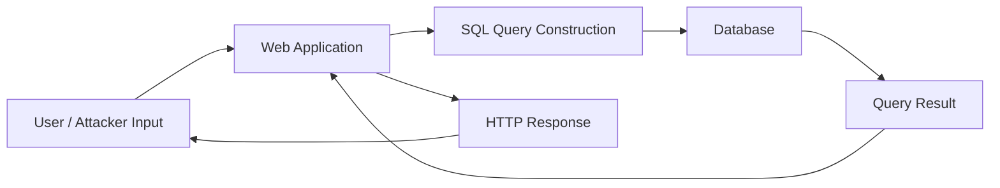
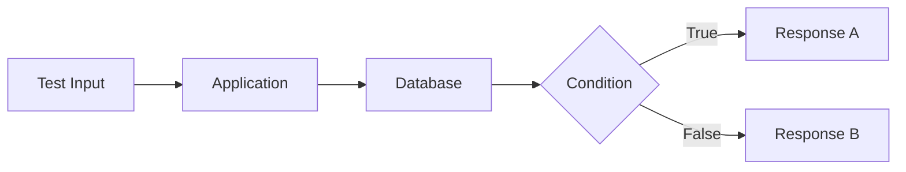
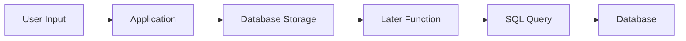
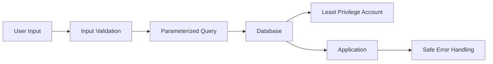
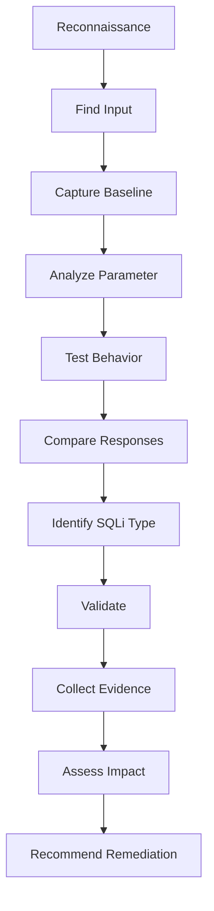

# SQL-Injection
Practical SQL Injection study covering SQLi types, request analysis, database behavior, validation, impact, and remediation.

# 1. Objective

The objective of this repository is to understand **SQL Injection** from both an offensive-security and defensive perspective.

Instead of only memorizing SQLi payloads, this project focuses on understanding:

```text
Application
     ↓
User Input
     ↓
SQL Query
     ↓
Database
     ↓
Application Response
     ↓
Security Analysis
```

The practical testing documented here is performed only against:

* Intentionally vulnerable labs
* CTF environments
* Local applications
* Systems where explicit authorization has been provided

---

# 2. What is SQL Injection?

**SQL Injection** is a vulnerability that occurs when untrusted user input is incorporated into a SQL query in an unsafe way.

A vulnerable application may conceptually construct a query like:

```text
SELECT * FROM users WHERE username = 'USER_INPUT';
```

The security problem occurs when the application treats part of the user's input as **SQL syntax** instead of treating it purely as data.

### Core concept

```text
Untrusted Input
       ↓
Application
       ↓
SQL Query Construction
       ↓
Database Parser
       ↓
Unexpected SQL Interpretation
```

The vulnerability is therefore not simply about "special characters."

The important question is:

> **Can user-controlled data change the meaning or structure of the SQL query?**

---

# 3. How SQL Injection Works

A normal application might receive:

```text
username = alice
```

and construct something conceptually similar to:

```sql
SELECT * FROM users
WHERE username = 'alice';
```

The intended flow is:

```text
User Input
    ↓
Application
    ↓
SQL Query
    ↓
Database
    ↓
Result
```

A vulnerable design may instead allow user-controlled data to alter the SQL expression.

```text
User Input
    ↓
Unsafe Query Construction
    ↓
Modified SQL Structure
    ↓
Database interprets query
    ↓
Unexpected result
```

---

# 4. SQL Injection Architecture



### Vulnerable point

The important area to investigate is:

```text
User Input
     ↓
SQL Query Construction
     ↑
     │
Potential Injection Point
```

---

# 5. Normal vs Vulnerable Query Construction

## Normal / Safer Design

Conceptually:

```text
User Input
     ↓
Parameterized Query
     ↓
Database
```

The database receives the SQL structure separately from the user-provided value.

---

## Vulnerable Design

Conceptually:

```text
User Input
     ↓
String Concatenation
     ↓
SQL Statement
     ↓
Database
```

Example of a vulnerable programming pattern:

```text
query = "SELECT * FROM users WHERE id = " + user_input
```

The exact syntax varies by programming language and database.

The security problem is the **mixing of SQL code and untrusted data**.

---

# 6. SQL Injection Types

The major categories include:

```text
                         SQL Injection
                              │
        ┌─────────────────────┼─────────────────────┐
        ↓                     ↓                     ↓
     In-Band                Blind               Other
        │                     │
    ┌───┴────┐          ┌─────┴─────┐
    ↓        ↓          ↓           ↓
 Error     UNION      Boolean      Time
 Based     Based       Based       Based
```

---

# 7. Error-Based SQL Injection

## What is it?

Error-based SQL Injection occurs when database errors caused by malformed or manipulated input are returned to the user.

### Flow

```text
Input
  ↓
Application
  ↓
Database
  ↓
SQL Error
  ↓
HTTP Response
  ↓
Information revealed
```

Possible information exposed by verbose errors may include:

* Database type
* Database version
* SQL syntax
* Table/column information
* Query structure
* Application framework details

### Detection

Look for changes such as:

```text
Normal request
     ↓
Normal response

Modified input
     ↓
Database error
     ↓
Different response
```

---

# 8. UNION-Based SQL Injection

## What is UNION SQLi?

The SQL `UNION` operator can combine results from compatible SQL queries.

In a vulnerable application, researchers may investigate whether an input can alter the query structure and cause additional database results to appear.

Conceptually:

```text
Original Query
      ↓
Additional Query
      ↓
Combined Result
      ↓
Application Response
```

### What to investigate

Determine:

1. Whether the parameter is injectable.
2. How many columns the original query returns.
3. Whether the data types are compatible.
4. Whether database output is reflected in the response.

Use only controlled lab data when demonstrating this technique.

---

# 9. Boolean-Based Blind SQL Injection

## What is Blind SQLi?

Blind SQL Injection occurs when the application does not directly display database errors or query results.

Instead, the tester observes differences in application behavior.

For example:

```text
Condition A
   ↓
Page behaves one way

Condition B
   ↓
Page behaves differently
```

### Flow



### What to compare

* Response body
* Status code
* Content length
* Redirect behavior
* Page content
* Application state

---

# 10. Time-Based Blind SQL Injection

Sometimes the application provides almost no visible difference between true and false conditions.

In some controlled scenarios, database behavior can instead be inferred from response timing.

Conceptually:

```text
Test A
  ↓
Normal response time

Test B
  ↓
Database performs measurable delay
  ↓
Different response time
```

### Important

Timing alone does not prove SQL Injection.

Network latency, server load, caching, and other application behavior can also cause delays.

Therefore:

```text
Timing observation
       ↓
Repeat
       ↓
Compare baseline
       ↓
Control variables
       ↓
Validate
```

---

# 11. Authentication-Related SQL Injection

SQL Injection can sometimes occur in login functionality when credentials are incorporated into SQL queries unsafely.

Conceptually:

```text
Username
    +
Password
    ↓
Application
    ↓
SQL Query
    ↓
Database
    ↓
Authentication Result
```

A vulnerable implementation may allow input to alter the authentication query.

### What to investigate

Do not immediately assume:

> "Login bypass = SQLi."

Instead determine:

```text
Input
 ↓
Query behavior
 ↓
Database response
 ↓
Authentication decision
```

The objective is to identify the actual root cause.

---

# 12. Second-Order SQL Injection

Second-order SQL Injection is different because the malicious input may not trigger the vulnerability immediately.

Conceptually:

```text
Input
  ↓
Application
  ↓
Database stores data
  ↓
Later application function
  ↓
Stored data used in SQL query
  ↓
SQL Injection
```

### Flow



This demonstrates why testing should consider the **complete data lifecycle**, not only the initial request.

---

# 13. How to Find SQL Injection

A practical SQLi investigation can follow this process:

```text
RECON
  ↓
Find Inputs
  ↓
Capture Baseline
  ↓
Analyze Parameters
  ↓
Test Behavior
  ↓
Compare Responses
  ↓
Identify SQL Context
  ↓
Validate
  ↓
Document Evidence
```

---

# 14. Step 1 — Reconnaissance

Identify places where user input reaches the application.

Look for:

```text
Search
Login
Product ID
User ID
Category
Filters
Sort parameters
URL parameters
POST parameters
Cookies
HTTP headers
API parameters
```

Example:

```text
/product?id=10
```

The `id` parameter becomes a potential input point for investigation.

---

# 15. Step 2 — Capture a Baseline Request

Before testing, capture the normal request.

Example:

```http
GET /product?id=10 HTTP/1.1
Host: lab.example
```

Save evidence:

```text
evidence/01-baseline-request.png
```

### Why?

The baseline gives you something to compare against.

---

# 16. Step 3 — Identify Parameters

Create a parameter inventory.

| Parameter  | Location | Type    | Interesting? |
| ---------- | -------- | ------- | ------------ |
| `id`       | URL      | Numeric | Yes          |
| `search`   | URL      | String  | Yes          |
| `category` | URL      | String  | Maybe        |
| `username` | POST     | String  | Yes          |
| `sort`     | URL      | String  | Maybe        |

The objective is to understand the application's attack surface.

---

# 17. Step 4 — Test Input Behavior

Start with harmless input and observe the application's response.

Record:

```text
Input
 ↓
HTTP status
 ↓
Response length
 ↓
Response content
 ↓
Errors
 ↓
Timing
```

Do not jump directly to complex exploitation.

The first question should be:

> **Does changing this input change the application's behavior in a way that suggests backend query processing?**

---

# 18. Step 5 — Look for Database Errors

Possible indicators include:

```text
SQL syntax error
Database error
Unexpected server error
Different response
Database-specific message
```

However:

> An application error does not automatically mean SQL Injection.

You need to establish a relationship between the input and the database behavior.

---

# 19. Step 6 — Compare Responses

Create a comparison:

| Test     | Status | Length | Content | Timing |
| -------- | -----: | -----: | ------- | -----: |
| Baseline | Record | Record | Record  | Record |
| Test A   | Record | Record | Record  | Record |
| Test B   | Record | Record | Record  | Record |

Look for reproducible differences.

---

# 20. Step 7 — Determine the SQLi Type

Once behavior is identified, determine which category best describes it.

```text
Database error?
      ↓
Error-Based

Additional query results?
      ↓
UNION-Based

Different true/false response?
      ↓
Boolean Blind

Different response timing?
      ↓
Time-Based Blind

Stored input triggers later?
      ↓
Second-Order
```

This classification helps explain the finding professionally.

---

# 21. Burp Suite Workflow

Burp Suite can be used to analyze the request.

```text
Browser
   ↓
Burp Proxy
   ↓
HTTP History
   ↓
Identify parameter
   ↓
Send to Repeater
   ↓
Modify one variable
   ↓
Compare response
   ↓
Document evidence
```

### Useful Burp features

* Proxy
* HTTP History
* Repeater
* Comparer
* Decoder
* Intruder for authorized testing

The tool is less important than understanding the request/response behavior.

---

# 23. SQL Injection Impact

Depending on the vulnerability and database privileges, SQL Injection can potentially lead to:

### Data disclosure

Unauthorized access to database information.

```text
Application
    ↓
Database
    ↓
Sensitive records
```

### Authentication bypass

A vulnerable authentication query may allow unintended authentication behavior.

### Data modification

If the database account has sufficient privileges, an attacker may potentially modify stored information.

### Data deletion

Excessive database privileges can increase the impact of SQL Injection.

### Administrative impact

If the vulnerable database account has excessive privileges, the consequences can become significantly more severe.

---

# 24. Why Database Privileges Matter

Consider:

```text
Application
     ↓
Database Account
     ↓
Permissions
```

If the application account has unnecessary privileges:

```text
SQLi
 ↓
More database permissions
 ↓
Greater impact
```

Therefore, **least privilege** is an important SQL Injection defense.

---

# 25. How to Protect Against SQL Injection

## 1. Parameterized Queries

The strongest general defense is to separate:

```text
SQL Structure
```

from:

```text
User Data
```

Conceptually:

```text
SQL Query Template
       +
User Parameter
       ↓
Parameterized Query
       ↓
Database
```

The database understands which part is SQL structure and which part is data.

---

# 26. Prepared Statements

Example conceptual pattern:

```text
SELECT * FROM users
WHERE username = ?
```

The user-provided value is supplied separately.

This is preferable to constructing SQL through string concatenation.

---

# 27. Avoid String Concatenation

### Risky design

```text
"SELECT ... WHERE id = " + user_input
```

### Safer design

```text
Prepared SQL statement
        +
Bound parameter
```

The exact implementation depends on the programming language and database library.

---

# 28. Input Validation

Validate input according to what the application actually expects.

For example:

```text
Expected:
Integer

Received:
Unexpected format
```

Reject invalid input where appropriate.

But remember:

> Input validation is an additional control, not a replacement for parameterized queries.

---

# 29. Least Privilege

The application database account should have only the permissions it requires.

For example:

```text
Application
     ↓
DB Account
     ↓
Only required tables/actions
```

Avoid giving the application unnecessary administrative database privileges.

---

# 30. Error Handling

Do not expose detailed database errors to end users.

### Instead of:

```text
Database-specific error
SQL syntax
Table information
Query details
```

Return a generic application error.

Detailed information should remain available in secure server-side logs.

---

# 31. Web Application Firewall

A WAF can provide an additional security layer.

```text
Internet
   ↓
WAF
   ↓
Application
   ↓
Database
```

However:

> A WAF should not be considered the primary fix for SQL Injection.

The application should still use parameterized queries and secure database practices.

---

# 32. Secure SQL Architecture



---

# 33. Vulnerable vs Secure

## Vulnerable

```text
User Input
     ↓
String Concatenation
     ↓
SQL Query
     ↓
Database
```

## Secure

```text
User Input
     ↓
Validation
     ↓
Parameterized Query
     ↓
Database
     ↓
Least Privilege
```

---

# 34. SQL Injection Testing Methodology

My methodology:



---

# 35. Validation Checklist

* [ ] Target is authorized
* [ ] Baseline request captured
* [ ] Input parameter identified
* [ ] Request/response behavior recorded
* [ ] Database-related behavior identified
* [ ] Test repeated
* [ ] Result compared with baseline
* [ ] SQLi type identified
* [ ] Evidence captured
* [ ] Impact assessed
* [ ] Remediation documented


---

# 36. Tools Used

### Testing

* Burp Suite
* Browser Developer Tools
* SQLMap — where appropriate in authorized labs

### Practice Platforms

* PortSwigger Web Security Academy
* TryHackMe
* Hack The Box
* Local vulnerable applications

### Knowledge

* SQL fundamentals
* HTTP fundamentals
* Database architecture
* Web application security
* OWASP security principles

---

# 37. Final Security Model

The most important concept I learned is:

```text
                 SQL Injection
                       │
                       ▼
                Untrusted Input
                       │
                       ▼
                SQL Query Layer
                       │
              ┌────────┴────────┐
              ↓                 ↓
         Safe Handling      Unsafe Handling
              │                 │
              ↓                 ↓
      Parameterized Query    Query Manipulation
              │                 │
              ↓                 ↓
           Database          SQL Injection
```

---

# 38. Key Takeaway

SQL Injection is not simply about knowing payloads.

A security tester should understand:

```text
Where does user input enter?
        ↓
Where is it used?
        ↓
Is it part of a SQL query?
        ↓
How is the query constructed?
        ↓
Does input change application behavior?
        ↓
Can the behavior be reproduced?
        ↓
What type of SQLi is present?
        ↓
What is the actual impact?
        ↓
How can developers fix it?
```

### My practical principle

> **CLAIM → EVIDENCE → PROCESS → VALIDATION → IMPACT → REMEDIATION**

---

# ⚠️ Ethical Testing

All testing documented in this repository should be performed only against:

* Your own applications
* Authorized penetration-testing environments
* PortSwigger Web Security Academy
* TryHackMe
* Hack The Box
* CTF challenges
* Intentionally vulnerable applications

Never test SQL Injection against systems without explicit authorization.

---

# 📚 Summary

```text
SQL Injection
│
├── Error-Based
│
├── UNION-Based
│
├── Boolean-Based Blind
│
├── Time-Based Blind
│
├── Authentication-Related
│
└── Second-Order
```

### Detection

```text
Find Input
    ↓
Capture Baseline
    ↓
Analyze Behavior
    ↓
Compare Responses
    ↓
Identify Database Interaction
    ↓
Validate
```

### Protection

```text
Parameterized Queries
        +
Prepared Statements
        +
Input Validation
        +
Least Privilege
        +
Safe Error Handling
        +
Defense in Depth
```


